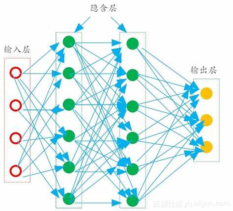
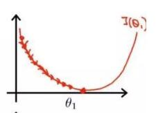
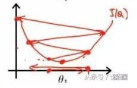

# 特征工程、交叉验证和超参数调优

## 特征工程

被纳入模型中的变量称为数据的特征。特征工程就是对特征进行操作。在建模技巧相近的情况下，特征工程能给模型带来较大的提升。特征工程的方法有，清洗数据、尝试从复杂的变量（如姓名）中提取模型能够利用的信息、探索两特征的交互项等。

### 读入数据

首先请读入数据，包括[playground的回归数据](https://www.kaggle.com/competitions/tabular-playground-series-jan-2021/overview)和[泰坦尼克号生存预测的二分类数据](https://www.kaggle.com/competitions/titanic/overview)，这里分别缩写为pg和tt。由于泰坦尼克早已有完整的数据，为了方便测试，直接读取。


```r
data_pg_train_raw = read_csv("../playground-regression/data/train.csv")
data_pg_test_raw  = read_csv("../playground-regression/data/test.csv")

data_tt_train_raw = read_csv("../twoclass/data/train.csv")
data_tt_test_raw  = read_csv("../twoclass/data/test.csv")
data_tt_test_leak = read_csv("../twoclass/data/titanic.csv")
```

操作一下数据。


```r
data_tt_test_raw = data_tt_test_raw %>% 
  mutate(Name = str_replace(Name, "\"", "")) %>% 
  mutate(Name = str_replace(Name, "\\\"", ""))
data_tt_test_leak = data_tt_test_leak %>% 
  mutate(name = str_replace(name, "\"", "")) %>% 
  mutate(name = str_replace(name, "\\\"", ""))

data_tt_test_raw = 
  inner_join(data_tt_test_raw, select(data_tt_test_leak, survived, name), by = c("Name" = "name")) %>% 
  rename(Survived = survived) %>% 
  distinct(Name, .keep_all = T)

# load("./data/example6.Rdata")
```

### 创建任务

首先查看数据形式，将无需特征工程的pg数据转为mlr3中的任务。


```{=html}
<div class="datatables html-widget html-fill-item" id="htmlwidget-e69247d6a1a29c893735" style="width:100%;height:auto;"></div>
<script type="application/json" data-for="htmlwidget-e69247d6a1a29c893735">{"x":{"filter":"none","vertical":false,"data":[["1","2","3","4","5","6"],[0,2,6,7,10,14],[0.3536003960677555,0.9072220265000728,0.1792871822942601,0.3593847738079436,0.3357908000487838,0.2564137750232814],[0.7387802758490386,0.1897563814383315,0.3553530531578394,0.1810492738729861,0.6826067981433357,0.6218345103984074],[0.6009390681938437,0.2155307618999737,0.6239720943689671,0.5513678956221049,0.6764807780727788,0.9594412434388164],[0.2933767919383172,0.8699151545898112,0.4378122234293921,0.2063863808638486,0.2194650387083545,0.9130515343428716],[0.2856911626758361,0.3013333859421893,0.2824757730595917,0.2807625823956033,0.2828612800430481,0.3875106958060037],[0.4580063448350751,0.5289578658101766,0.3208258655352028,0.4820755220283451,0.581720896787479,0.3146198579785045],[0.620703563617202,0.3903509900795343,0.3867886527820846,0.5066773482428131,0.7486392593895049,0.3220138464767012],[0.4222487709348951,0.5211120354698421,0.7764221942761969,0.3627925784349201,0.3501581270242251,0.6146734121171415],[0.3692033022080026,0.7947789056868737,0.2222678530279728,0.3797373249796229,0.4489147019808153,0.2925482322080151],[0.4357272439789657,0.7985798582024258,0.2291024516222432,0.3456862953272163,0.5068780191444434,0.8995779618918661],[0.5505403961577522,0.446474708967044,0.2119128422170466,0.4452762341441973,0.8177212559561028,0.2781041527161341],[0.6991335909021472,0.449036640790115,0.2226510870920123,0.5184848432528382,0.8058953761128491,0.2740855067711794],[0.2868640602821669,0.9169642649918256,0.3271640908368328,0.2990276136574325,0.7905910038399755,0.4181779141030444],[0.3645148370303677,0.5130024430753199,0.8279407835393642,0.5981657741216913,0.2492753526923788,0.715105694180321]],"container":"<table class=\"display\">\n  <thead>\n    <tr>\n      <th> <\/th>\n      <th>id<\/th>\n      <th>cont1<\/th>\n      <th>cont2<\/th>\n      <th>cont3<\/th>\n      <th>cont4<\/th>\n      <th>cont5<\/th>\n      <th>cont6<\/th>\n      <th>cont7<\/th>\n      <th>cont8<\/th>\n      <th>cont9<\/th>\n      <th>cont10<\/th>\n      <th>cont11<\/th>\n      <th>cont12<\/th>\n      <th>cont13<\/th>\n      <th>cont14<\/th>\n    <\/tr>\n  <\/thead>\n<\/table>","options":{"scrollX":true,"columnDefs":[{"className":"dt-right","targets":[1,2,3,4,5,6,7,8,9,10,11,12,13,14,15]},{"orderable":false,"targets":0}],"order":[],"autoWidth":false,"orderClasses":false}},"evals":[],"jsHooks":[]}</script>
```

不知道你们从哪学的Task$new()的方法，尽量少用。


```r
task_pg_train = as_task_regr(data_pg_train_raw[, -1], target = "target")
task_pg_test  = as_task_regr(mutate(data_pg_test_raw[, -1], target = 1), target = "target")
```

接下来是大头。然后观察tt数据的形式。


```{=html}
<div class="datatables html-widget html-fill-item" id="htmlwidget-d9e8f3480776b7503c87" style="width:100%;height:auto;"></div>
<script type="application/json" data-for="htmlwidget-d9e8f3480776b7503c87">{"x":{"filter":"none","vertical":false,"data":[["1","2","3","4","5","6"],[1,2,3,4,5,6],[0,1,1,1,0,0],[3,1,3,1,3,3],["Braund, Mr. Owen Harris","Cumings, Mrs. John Bradley (Florence Briggs Thayer)","Heikkinen, Miss. Laina","Futrelle, Mrs. Jacques Heath (Lily May Peel)","Allen, Mr. William Henry","Moran, Mr. James"],["male","female","female","female","male","male"],[22,38,26,35,35,null],[1,1,0,1,0,0],[0,0,0,0,0,0],["A/5 21171","PC 17599","STON/O2. 3101282","113803","373450","330877"],[7.25,71.2833,7.925,53.1,8.050000000000001,8.458299999999999],[null,"C85",null,"C123",null,null],["S","C","S","S","S","Q"]],"container":"<table class=\"display\">\n  <thead>\n    <tr>\n      <th> <\/th>\n      <th>PassengerId<\/th>\n      <th>Survived<\/th>\n      <th>Pclass<\/th>\n      <th>Name<\/th>\n      <th>Sex<\/th>\n      <th>Age<\/th>\n      <th>SibSp<\/th>\n      <th>Parch<\/th>\n      <th>Ticket<\/th>\n      <th>Fare<\/th>\n      <th>Cabin<\/th>\n      <th>Embarked<\/th>\n    <\/tr>\n  <\/thead>\n<\/table>","options":{"scrollX":true,"columnDefs":[{"className":"dt-right","targets":[1,2,3,6,7,8,10]},{"orderable":false,"targets":0}],"order":[],"autoWidth":false,"orderClasses":false}},"evals":[],"jsHooks":[]}</script>
```

计算缺失值。r中有用于专业分析缺失值分布规律的包，如mice。但是缺失值的处理一般从简即可。


```
## PassengerId    Survived      Pclass        Name         Sex         Age 
##           0           0           0           0           0         177 
##       SibSp       Parch      Ticket        Fare       Cabin    Embarked 
##           0           0           0           0         687           2
```

有关泰坦尼克生存预测的具体特征处理方法，请参考[超复杂的特征处理](https://zhuanlan.zhihu.com/p/50194676)。我这里简化了部分，包括将name列中的的称呼提取并概括为若干类，然后将含有大量的缺失的列中的缺失值填充为未知类，然后将Cabin列中的首字母提取，其意义是客舱，具有一定价值，删除ID、Embarked等列。plural_names这部分没用，但我懒得删。


```r
data_train_mediated1 = data_tt_train_raw %>% 
  mutate(Family = str_extract(Name, "^[^,]+"), 
         Appellation = str_sub(str_extract(Name, ",\\s(\\w+)(?=\\.)"), start = 3), 
         Seat = str_sub(Cabin, end = 1))

a = table(data_train_mediated1$Family)
plural_names = names(a)[a != 1]

b = table(data_train_mediated1$Appellation)
TitleDict = c(Mr = "Mr",
  Mlle = "Miss", Miss = "Miss",
  Master = "Master", Jonkheer = "Master",
  Mme = "Mrs", Ms = "Mrs", Mrs = "Mrs",
  Don = "Master", Sir = "Master",
  Lady = "Miss",
  Capt = "Officer", Col = "Officer", Major = "Officer", Dr = "Officer", Rev = "Officer")

Seats = LETTERS[1:7]

lst_par = list(plural_names, TitleDict, Seats)
preprocess = function (pars, data_raw) {
  judge = "Survived" %in% colnames(data_raw)
  
  if (judge) {
    data_raw %>% 
      mutate(Name = str_replace(Name, "\"", "")) %>% 
      mutate(Name = str_replace(Name, "\\\"", "")) %>% 
      mutate(Family = str_extract(Name, "^[^,]+"), 
             Appellation = str_sub(str_extract(Name, ",\\s(\\w+)(?=\\.)"), start = 3), 
             Seat = str_sub(Cabin, end = 1)) %>% 
      select(-Name, -Cabin, -PassengerId, -Ticket) %>% 
      mutate(Seat = ifelse(Seat %in% lst_par[[3]], Seat, "Unknown"), 
             # Family = ifelse(Family %in% lst_par[[1]], "pairs", "Single"), 
             Appellation = lst_par[[2]][Appellation], 
             across(where(is.character), factor), 
             Sex = as.integer(Sex) - 1) %>% 
      select(-Family, -Embarked)
  } else {
    data_raw %>% 
      mutate(Name = str_replace(Name, "\"", "")) %>% 
      mutate(Name = str_replace(Name, "\\\"", "")) %>% 
      mutate(Family = str_extract(Name, "^[^,]+"), 
             Appellation = str_sub(str_extract(Name, ",\\s(\\w+)(?=\\.)"), start = 3), 
             Seat = str_sub(Cabin, end = 1)) %>% 
      select(-Name, -Cabin, -PassengerId, -Ticket) %>% 
      mutate(Seat = ifelse(Seat %in% lst_par[[3]], Seat, "Unknown"), 
             # Family = ifelse(Family %in% lst_par[[1]], "pairs", "Single"), 
             Appellation = lst_par[[2]][Appellation], 
             across(where(is.character), factor), 
             Sex = as.integer(Sex) - 1) %>% 
      select(-Family, -Embarked) %>% 
      mutate(Survived = c(rep(0, nrow(.)-1), 1))
  }
}

data_tt_train = preprocess(lst_par, data_tt_train_raw)
data_tt_test  = preprocess(lst_par, data_tt_test_raw)

task_tt_train_raw = as_task_classif(data_tt_train, target = "Survived")
task_tt_test_raw  = as_task_classif(data_tt_test, target = "Survived")
```

然后对泰坦尼克生存数据中的数据进行进一步处理，包括对含少量缺失值的特征进行插补、将因子型特征进行独热编码。

泰坦尼克生存数据属于分类任务，分类任务需要注意的一点是各个类别的数量要均等，否则会导致模型比较偏好一部分类别，这时候如果还以0.5作为阈值，预测结果就会偏向占比较多的类别。这一现象称作类别不均衡。对此要进行抽样或生成假样本以平衡数据。
 
但是这个任务十分特殊，即训练集、测试集数据分布不一致。这时候进行抽样或者生成假样本会导致模型错误的重视某一部分样本，导致模型效果反而变差。考虑到样本不均衡其实并不严重，所以我们也不进行平衡样本，只在后面改阈值。

这里为了分辨效果，我们做一组平衡的，做一组不平衡的。


```r
preprocess_pipe = 
  po("imputelearner", id = "num", lrn("regr.lightgbm"), affect_columns = selector_type("numeric")) %>>% 
  po("imputelearner", id = "fct", lrn("classif.rpart"), affect_columns = selector_type("factor")) %>>% 
  po("encode", method = "one-hot")
up_sp = po("classbalancing", reference = "minor",
           adjust = "major")

preprocess_pipe$train(task_tt_train_raw)
```

```
## $encode.output
## <TaskClassif:data_tt_train> (891 x 21)
## * Target: Survived
## * Properties: twoclass
## * Features (20):
##   - dbl (20): Age, Appellation.Master, Appellation.Miss,
##     Appellation.Mr, Appellation.Mrs, Appellation.Officer,
##     Appellation.factor, Fare, Parch, Pclass, Seat.A, Seat.B, Seat.C,
##     Seat.D, Seat.E, Seat.F, Seat.G, Seat.Unknown, Sex, SibSp
```

```r
task_tt_train_nob = preprocess_pipe$predict(task_tt_train_raw)[[1]]
task_tt_train = up_sp$train(list(preprocess_pipe$predict(task_tt_train_raw)[[1]]))[[1]]
task_tt_test  = preprocess_pipe$predict(task_tt_test_raw)[[1]]
```

处理好了以后我们使用简单的学习器进行拟合。


```r
toylrn_r = lrn("regr.lightgbm") # 用lightgbm的原因是因为它收敛的快
toylrn_r$train(task_pg_train)
toypre_r = toylrn_r$predict(task_pg_test)

toylrn_c = lrn("classif.lightgbm")
toylrn_c$train(task_tt_train)
toypre_c = toylrn_c$predict(task_tt_test)
```

设计一个小函数用于汇总结果提交


```r
summary_of = function(pre, is_titanic = F) {
  if (is_titanic) {
    tibble(
      PassengerId = data_tt_test_raw$PassengerId, 
      Survived = pre$response
    )
  } else {
    tibble(
      id = data_pg_test_raw$id, 
      target = pre$response
    )
  }
}

write_csv(summary_of(toypre_r), "temp/submission.csv")
```

playground的结果为0.7031，模型偏差已经十分逼近随机误差了，再看一下泰坦尼克的结果。


```r
toypre_c$score(msr("classif.acc"))
```

```
## classif.acc 
##   0.7296651
```

不好也不坏，接下来我们想一下如何优化这两个结果。

## 超参数调优

模型参数是模型内部的配置变量，需要用数据估计模型参数的值，随数据变化而变化；模型超参数是模型外部的配置，需要人为设定，不随数据变化而变化。

举深度学习中最简单的多层感知机的例子可能更好懂，参数是每个具体节点的斜率和偏置，超参数是模型的层数和节点数。

下图中的线就是节点中斜率，表示节点之间的联系，节点数和层数就是模型的超参数。



除了这些有形的超参数以外，还有许多更多无形的超参数。模型在不同的超参数下对数据的学习程度也不同。合适的超参数能加速模型收敛、增强模型泛化能力或者对数据的学习程度，不合适的超参数会导致模型压根没法训练。比如knn中如果把k设的过大，会发现所有数据都被分成了一个类。梯度提升时如果学习率设的过高，那模型效果反而会越训练越差。

<div class="figure" style="text-align: center">

<p class="caption">(\#fig:unnamed-chunk-13)较小的学习率能够正确拟合模型（左图）；过大的学习率会发生剧烈的震荡，越来越偏离目标（右图）</p>
</div>

所以，就此意义上说，超参数最重要的意义是让模型能够训练起来，大多数情况下，一组经过测验的甚至默认固定超参数即可满足需求。超参数调优本质上就是对每一种超参数组合拟合一个模型，以期模型在交叉验证中性能提升。根据调优过程中使用的数值优化的方式不同可分为若干类，常用的策略如下：

1. 网格搜索：对每种超参数组合进行评估，在超参数个数较少的模型上适用，精确度最高。
2. 随机搜索：随机组合超参数，有一定的局部最优的风险，耗时短。
3. 贝叶斯优化：记录每次组合的结果，在以往结果的基础上进行优化。耗时长。由于假设较强，实际套用效果并不佳。
4. hyperband：综合随机搜索和贝叶斯优化，逐渐缩小搜索空间。实际使用较多。

可以设置若干个超参数组合的效果不如此前最优的超参数组合后终止搜索。

> 如果一个模型需要调参才能得到某个结果，大概率已经过拟合了。如果调参都得不到某个结果，那只能说明结果本就不存在。另外，模型本身不会保证结果对错，只能给出在模型假设下的推断，但很多模型不但是错的，还没有用。
>
> ---于淼

须知，超参数调优只能略微提升训练集上交叉验证的结果，如果超参数搜索区间比较离谱，甚至会比默认参数更差。如果训练集、测试集分布不一致，调优后的结果在测试集上的表现甚至会更差。

### mlr3实现

mlr3中使用to_tune()为学习器的超参数指定搜索空间，使用ti()将任务、学习器、指标、终止条件等内容绑定为一个instance（实例），调用tnr()进行调参。

搜索空间与设置普通参数的形式无异：


```r
learner_lgb_r = lrn("regr.lightgbm")
learner_lgb_r$param_set$set_values(
  learning_rate = to_tune(0.001, 0.1),
  num_iterations = to_tune(p_int(256, 1024, tags = "budget")),
  max_depth = to_tune(1, 10),
  num_leaves = to_tune(5, 53),
  bagging_fraction = to_tune(0.75, 1)
)
```

然后与任务绑定到同一个实例里后使用tnr搜索。也可以使用auto_tuner等函数绑定搜索。

对于决策树、随机森林、xgboost这种著名模型，mlr3在mlr3tuningspace中收集了常用的搜索空间，只需要用lts()括起来就不需要手动设置值了。如下。


```r
learner_xgb_r = lts(lrn("regr.xgboost"))
```

超参数搜索空间一般只用一套固定的经过验证的超参数搜索空间和调参器。只有在复杂的任务上才需要灵活做出调整。

下面的超参数我之前搜索过了，十分耗时，就不再搜索了。


```r
# learner_lgb_r = lrn("regr.lightgbm")
# learner_lgb_r$param_set$set_values(
#   learning_rate = to_tune(0.001, 0.1),
#   num_iterations = to_tune(p_int(256, 1024, tags = "budget")),
#   max_depth = to_tune(1, 10),
#   num_leaves = to_tune(5, 53),
#   bagging_fraction = to_tune(0.75, 1)
# )
# 
# instance = ti(
#   task = task_pg_train,
#   learner = learner_lgb_r,
#   resampling = rsmp("holdout"),
#   measures = msr("regr.rmse"),
#   terminator = trm("evals", n_evals = 50)
# )
# 
# tuner = tnr("hyperband", eta = 2, repetitions = 2)
# tuner$optimize(instance)

learner_lgb_r = lrn("regr.lightgbm")

# 这是我之前搜索过的结果
learner_lgb_r$param_set$set_values(
  learning_rate = 0.0539276, 
  num_iterations = 256, 
  max_depth = 3, 
  num_leaves = 5, 
  bagging_fraction = 0.82
)

learner_lgb_r$train(task_pg_train)

prediction_lgb_r = learner_lgb_r$predict(task_pg_test)
write_csv(summary_of(prediction_lgb_r), "temp/submission.csv")
```

超参数调优后的结果是0.6994。

一鼓作气，我们再试试在泰坦尼克生存预测数据中测试集上的表现。


```r
learner_lgb_c = lrn("classif.lightgbm")
learner_lgb_c$param_set$set_values(
  learning_rate = to_tune(0.001, 0.1),
  num_iterations = to_tune(p_int(256, 1024, tags = "budget")),
  max_depth = to_tune(1, 10),
  num_leaves = to_tune(5, 53),
  bagging_fraction = to_tune(0.75, 1)
  # early_stopping = TRUE, 
  # early_stopping_rounds = to_tune(128, 256)
)

instance = ti(
  task = task_tt_train,
  learner = learner_lgb_c,
  resampling = rsmp("holdout"),
  measures = msr("classif.acc"),
  terminator = trm("evals", n_evals = 20)
)

tuner = tnr("mbo") # 贝叶斯优化
tuner$optimize(instance)

learner_lgb_c$param_set$values = instance$result_learner_param_vals
learner_lgb_c$train(task_tt_train)

prediction_lgb_c = learner_lgb_c$predict(task_tt_test)
```

```r
prediction_lgb_c$score(msr("classif.acc"))
```

```
## classif.acc 
##   0.7416268
```

效果反而变差了（如果文档上显示没有变差，那就是碰巧了，下同理）。我们来进一步分析原因。


```r
cv5_lgb_c = resample(task_tt_train, toylrn_c, rsmp("cv", folds = 5))
cv5_lgb_c_tuned = resample(task_tt_train, learner_lgb_c, rsmp("cv", folds = 5))

cv5_lgb_c$aggregate(msr("classif.acc")); cv5_lgb_c_tuned$aggregate(msr("classif.acc"))
```

```
## classif.acc 
##   0.7996458
```

```
## classif.acc 
##   0.8026191
```

调参的结果在训练集上的交叉验证更好，这是再自然不过的。但是如果训练集和测试集的分布不一致，那就会导致调参的结果在测试集上变差。

### 使用注意

#### hyperband

使用hyperband调参时，需要为某个参数指定budget标签，意指控制计算资源的超参数，一般设置在GBDT的迭代轮数或树的深度上。

#### early stop

我们再来看几个对比。

简单模型在未经平衡的数据上表现较好。


```r
lrn("classif.rpart")$train(task_tt_train)$predict(task_tt_test)$score(msr("classif.acc"))
```

```
## classif.acc 
##   0.7368421
```

```r
lrn("classif.rpart")$train(task_tt_train_nob)$predict(task_tt_test)$score(msr("classif.acc"))
```

```
## classif.acc 
##    0.777512
```


```r
learner_rpart_c = lts(lrn("classif.rpart"))

instance = ti(
  task = task_tt_train_nob,
  learner = learner_rpart_c,
  resampling = rsmp("holdout"),
  measures = msr("classif.acc"),
  terminator = trm("evals", n_evals = 20)
)

tuner = tnr("grid_search")
tuner$optimize(instance)

learner_rpart_c$param_set$values = instance$result_learner_param_vals
learner_rpart_c$train(task_tt_train_nob)
```

调参后的决策树表现变差。


```r
learner_rpart_c$predict(task_tt_test)$score(msr("classif.acc"))
```

```
## classif.acc 
##   0.7631579
```

复杂模型在相同的数据上表现劣于简单模型。


```r
lrn("classif.lightgbm")$train(task_tt_train_nob)$predict(task_tt_test)$score(msr("classif.acc"))
```

```
## classif.acc 
##   0.7440191
```

这些都离不开我们所说的训练集测试集分布不一致的问题。模型学习了过多训练集中的特征，部分特征在测试集中并不存在，也可以称之为过拟合的一种（但也未必是过拟合，有可能是由于测试集样本数量较少，不具有代表性）。这种现象在过采样中十分常见。

所以面对这种做法，我们需要尽量减小模型的学习能力。

对于简单模型，提供未经平衡的数据或欠采样的数据；对于GBDT等需要迭代的复杂模型，采用及早终止的方法。设置及早终止，需要将一部分数据划分为验证集，即标签已知但不用于训练只用于评价模型能力的样本。

下面采用及早终止，略微减轻了过拟合，但还是劣于简单的决策树。


```r
split = partition(task_tt_train_nob)
task_tt_train_nob_e = task_tt_train_nob$clone(deep = T)$set_row_roles(split$test, "test")

learner_lgb_c = lrn("classif.lightgbm")
learner_lgb_c$param_set$set_values(
  early_stopping = TRUE,
  early_stopping_rounds = 128
)

pre_test = learner_lgb_c$train(task_tt_train_nob_e)$predict(task_tt_test)
pre_test$score(msr("classif.acc"))
```

```
## classif.acc 
##    0.784689
```

须知，不是任何场合都适用早停。如果用于验证的数据过少，很可能导致模型受到这部分数据的约束，从而欠拟合。如果划分的数据过多，那么又会损失宝贵的训练数据。早停只适用于复杂的数据分布上。

由于使用了不平衡数据，我们采用另一种策略平衡模型，调整阈值，也是后处理的一种。


```r
# 注意一定要在训练集上找阈值
pre_train = learner_lgb_c$train(task_tt_train_nob_e)$predict(task_tt_train_nob_e)

# optimize是一种一维优化函数，用于使目标函数的值最小
# 我们的目标使得acc最大，也就是使得acc的负值最小
to_optim = function(pre_train, num) {
  pre_train$set_threshold(num)
  -pre_train$score(msr("classif.acc"))
}

for_thres = function(pre_train) {
  thres = optimize(\(x) to_optim(pre_train, x), lower = 0, upper = 1)$minimum
  
  cat("before: ", pre_train$set_threshold(0.5)$score(msr("classif.acc")),
      "\n",
      "after: ", pre_train$set_threshold(thres)$score(msr("classif.acc")))
  
  thres
}

thres = for_thres(pre_train)
```

```
## before:  0.8710218 
##  after:  0.879397
```

```r
# 这个方法仅供尝试，未必总是能取得好效果。
pre_test$set_threshold(thres)$score(msr("classif.acc"))
```

```
## classif.acc 
##   0.7799043
```

## 交叉验证

交叉验证是一种抽样策略，k折交叉验证意为将数据随机分为均等的k份，每次用k-1折的数据训练一个模型，再剩下一折上验证，反复k次。k个模型在各自验证集上评价指标取平均，可以相对正确的反映模型的泛化能力。假如训练集和测试集分布一致，交叉验证的结果与在测试集上的表现趋势相同。

上述方法中我们已经看到了用resample和rsmp进行不同策略的抽样以评价模型的实现。下面我们以提升交叉验证表现的方式尝试对playground的结果作进一步优化。

### 模型堆叠

stack（堆叠）是表格型数据的一种策略，在baseline几乎能完全解释模型方差的当下，其能给模型带来0.1%到1%的提升，这一点点差距就可以在排名上把其它人甩开。但是这种提升是一种双刃剑，以降低模型解释性为代价。

有关stack的介绍可以参考[视频](https://www.bilibili.com/video/BV11L411j7sX?p=29&vd_source=9c83e948ccfc954778d90b01f0a653d4)和[文解](https://zhuanlan.zhihu.com/p/75411512)。

简而言之，堆叠就是在预测数据的基础上用一个弱学习器综合多个强预测的结果。


```r
load("./data/hps.Rdata")

learner_xgb_r = lrn("regr.xgboost");  learner_xgb_r$param_set$values = hp_xgb
learner_lgb_r = lrn("regr.lightgbm"); learner_lgb_r$param_set$values = hp_lgb
learner_ctb_r = lrn("regr.catboost"); learner_ctb_r$param_set$values = hp_ctb

# 我们可以使用以下两种方式创建交叉验证的预测结果
# learner_cv默认是3折且无法显式修改，只能通过改源码的方法修改
gstack_test = gunion(list(
  po("learner_cv", learner_xgb_r, id = "xgb"),
  po("learner_cv", learner_lgb_r, id = "lgb"),
  po("learner_cv", learner_ctb_r, id = "ctb"))) %>>%
  po("featureunion")

resampled_1 = gstack_test$train(task_pg_train)[[1]] # 此为task对象

cv5_lgb = resample(task_pg_train, learner_lgb_r, rsmp("cv", folds = 5)) # 如此重复三次即可
resampled_lgb_2 = cv5_lgb$prediction() # 此为prediction对象
```

接下来我们训练一个基学习器。岭回归的较为常用的基学习器。


```r
learner_base = lrn("regr.glmnet", alpha = 0)

search_space = ps(
  s = p_dbl(lower = 0.001, upper = 2)
)

at = auto_tuner(
  tuner = tnr("grid_search"),
  learner = learner_base,
  resampling = rsmp("cv", folds = 5), 
  measure = msr("regr.rmse"), 
  search_space = search_space, 
  terminator = trm("evals", n_evals = 50)
)

at$train(resampled_1)

hp_base = at$tuning_result$learner_param_vals[[1]]
learner_base$param_set$values = hp_base

# 用po链接还是一个po，所以最后要转成一个learner
glearner = gunion(list(
  po("learner_cv", learner_xgb_r, id = "xgb"),
  po("learner_cv", learner_lgb_r, id = "lgb"),
  po("learner_cv", learner_ctb_r, id = "ctb"))) %>>%
  po("featureunion") %>>%
  learner_base %>% 
  as_learner()

# 再用相同的方法重抽样看效果
cv_stack = resample(task_pg_train, glearner, rsmp("cv", folds = 5))
cv_stack$aggregate()
```

计算速度太慢了，不在文档里计算了。总之cv是要低一点，然后再榜上成绩也达到了0.696。还可以用cv优化超参数进一步提升排名。但是没啥收益，就不卷了。

### 交叉验证失效怎么办？

在真实数据中，能够用于训练的数据少，数据的复杂度高。如果交叉验证和在测试集上的表现趋势不明显，主要可能有以下情况：

1. 训练集不具有代表性，测试集的分布与训练集不一致
2. 测试集过小
3. 训练集测试集的特征质量低下，模型在训练集上的cv就不高

此情况下大多数技巧都会失效，对此常用的做法是使用简单的模型。如上面不调参决策树强于调参后的决策树强于lightgbm。在一定范围内降低训练集cv，提升在测试集上的效果。


