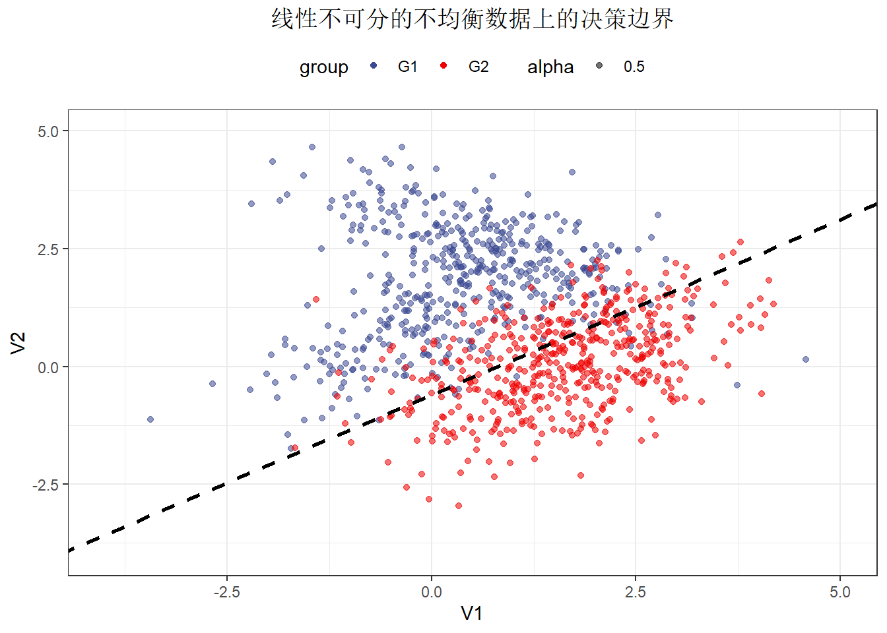

# 理解机器学习里数据不均衡

## data_prepare


```r
mu = rep(0, 2) 
Sigma1 = matrix(0.7, nrow=2, ncol=2) + diag(2) * 0.3
Sigma2 = matrix(0.5, nrow=2, ncol=2) + diag(2) * 0.5 
mat1 = mvrnorm(n = 1000, mu = mu, Sigma = Sigma1) + matrix(rep(c(0, 1),   each = 1000), ncol=2)
mat2 = mvrnorm(n = 1000, mu = mu, Sigma = Sigma2) + matrix(rep(c(1.5, 0), each = 1000), ncol=2)

data_train = rbind(mat1, mat2) %>% 
  as_tibble() %>% 
  mutate(group = factor(rep(c("G1", "G2"), each = 1000)))
```

```
## Warning: The `x` argument of `as_tibble.matrix()` must have unique column names if
## `.name_repair` is omitted as of tibble 2.0.0.
## ℹ Using compatibility `.name_repair`.
## This warning is displayed once every 8 hours.
## Call `lifecycle::last_lifecycle_warnings()` to see where this warning was
## generated.
```

```r
num = 200
data_train_un = rbind(mat1, mat2[sample(1:1000, num), ]) %>% 
  as_tibble() %>% 
  mutate(group = factor(rep(c("G1", "G2"), c(1000, num))))

data_test = rbind(
  mvrnorm(n = 500, mu = mu, Sigma = Sigma1) + matrix(rep(c(0, 1),   each = 500), ncol=2), 
  mvrnorm(n = 500, mu = mu, Sigma = Sigma2) + matrix(rep(c(1.5, 0), each = 500), ncol=2)
) %>% as_tibble() %>% mutate(group = factor(rep(c("G1", "G2"), each = 500)))

data_train %>% 
  ggplot() + 
  geom_point(aes(V1, V2, color = group, alpha = 0.5)) + 
  scale_color_aaas() + 
  xlim(-4, 5) +
  ylim(-4, 5) +
  ggtitle("数据分布") + 
  theme_bw() + 
  theme(
    legend.position = "top", 
    plot.title = element_text(hjust = 0.5)
  )
```


```r
data_train_un %>% 
  ggplot() + 
  geom_point(aes(V1, V2, color = group, alpha = 0.5)) + 
  scale_color_aaas() + 
  xlim(-4, 5) +
  ylim(-4, 5) +
  ggtitle("数据分布") + 
  theme_bw() + 
  theme(
    legend.position = "top", 
    plot.title = element_text(hjust = 0.5)
  )
```


## model

### 数据均衡的模型


```r
model1 = glm(group ~ ., data = data_train, family = binomial())
# as.matrix(data.frame(V0 = 1, V1 = data_train$V1, V2 = data_train$V2)) %*% coef(model1)
coef1 = coef(model1)
coef1
```

```
## (Intercept)          V1          V2 
##  -0.6530901   3.4637531  -3.1321564
```

```r
beta0 = coef1[1]
beta1 = coef1[2]
beta2 = coef1[3]

data_test %>% 
  ggplot() + 
  geom_point(aes(V1, V2, color = group, alpha = 0.5)) + 
  geom_abline(intercept = -beta0/beta2, slope = -beta1/beta2, 
              linetype = "dashed", linewidth = 1) + 
  scale_color_aaas() + 
  xlim(-4, 5) +
  ylim(-4, 5) +
  ggtitle("数据均衡的模型") + 
  theme_bw() + 
  theme(
    legend.position = "top", 
    plot.title = element_text(hjust = 0.5)
  )
```


### 数据不均衡的模型


```r
model2 = glm(group ~ ., data = data_train_un, family = binomial())

coef2 = coef(model2)
coef2
```

```
## (Intercept)          V1          V2 
##   -2.377790    3.458357   -2.936726
```

```r
beta0 = coef2[1]
beta1 = coef2[2]
beta2 = coef2[3]

data_test %>% 
  ggplot() + 
  geom_point(aes(V1, V2, color = group, alpha = 0.5)) + 
  geom_abline(intercept = -beta0/beta2, slope = -beta1/beta2, 
              linetype = "dashed", linewidth = 1) + 
  scale_color_aaas() + 
  xlim(-4, 5) +
  ylim(-4, 5) +
  ggtitle("数据不均衡的模型") + 
  theme_bw() + 
  theme(
    legend.position = "top", 
    plot.title = element_text(hjust = 0.5)
  )
```


```r
coef1; coef2
```

```
## (Intercept)          V1          V2 
##  -0.6530901   3.4637531  -3.1321564
```

```
## (Intercept)          V1          V2 
##   -2.377790    3.458357   -2.936726
```

### 训练集上后处理准确率的模型


```r
model2 = glm(group ~ ., data = data_train_un, family = binomial())

coef2 = coef(model2)
coef2
```

```
## (Intercept)          V1          V2 
##   -2.377790    3.458357   -2.936726
```

```r
beta0 = coef2[1]
beta1 = coef2[2]
beta2 = coef2[3]

logit = function(x) exp(x) / (exp(x) + 1)
logit_inverse = function(y) log(y) - log(1-y)
acc = function(truth, response) sum(truth - response == 0)/length(truth)
decide = function(response, thres=0.5) ifelse(response > thres, 1, 0)

# acc(as.numeric(data_train_un$group) - 1, decide(logit(predict(model, data_train_un))))
post = optimize(\(x) -acc(as.numeric(data_train_un$group) - 1, decide(logit(predict(model2, data_train_un)), thres=x)), lower = 0, upper = 1)
Z = post$minimum
post
```

```
## $minimum
## [1] 0.5305961
## 
## $objective
## [1] -0.9608333
```

```r
data_test %>% 
  ggplot() + 
  geom_point(aes(V1, V2, color = group, alpha = 0.5)) + 
  geom_abline(intercept = Z/beta2 - beta0/beta2, slope = -beta1/beta2, 
              linetype = "dashed", linewidth = 1) + 
  scale_color_aaas() + 
  xlim(-4, 5) +
  ylim(-4, 5) +
  ggtitle("训练集上后处理准确率的模型") + 
  theme_bw() + 
  theme(
    legend.position = "top", 
    plot.title = element_text(hjust = 0.5)
  )
```


### 测试集上后处理准确率


```r
model2 = glm(group ~ ., data = data_train_un, family = binomial())

coef2 = coef(model2)
coef2
```

```
## (Intercept)          V1          V2 
##   -2.377790    3.458357   -2.936726
```

```r
beta0 = coef2[1]
beta1 = coef2[2]
beta2 = coef2[3]

post = optimize(\(x) -acc(as.numeric(data_test$group) - 1, decide(logit(predict(model2, data_test)), thres=x)), lower = 0, upper = 1)
Z = post$minimum
post
```

```
## $minimum
## [1] 0.2293371
## 
## $objective
## [1] -0.909
```

```r
data_test %>% 
  ggplot() + 
  geom_point(aes(V1, V2, color = group, alpha = 0.5)) + 
  geom_abline(intercept = Z/beta2 - beta0/beta2, slope = -beta1/beta2, 
              linetype = "dashed", linewidth = 1) + 
  scale_color_aaas() + 
  xlim(-4, 5) +
  ylim(-4, 5) +
  ggtitle("测试集上后处理准确率") + 
  theme_bw() + 
  theme(
    legend.position = "top", 
    plot.title = element_text(hjust = 0.5)
  )
```


### 过采样的模型


```r
up_sample = function(tb, index) tb[c(1:1000, sample(index, 1000, replace = T)), ]
data_train_un_up   = up_sample(data_train_un, 1001:1200)

model_up = glm(group ~ ., data = data_train_un_up, family = binomial())

coef2 = coef(model_up)
beta0 = coef2[1]
beta1 = coef2[2]
beta2 = coef2[3]

data_test %>% 
  ggplot() + 
  geom_point(aes(V1, V2, color = group, alpha = 0.5)) + 
  geom_abline(intercept = -beta0/beta2, slope = -beta1/beta2, 
              linetype = "dashed", linewidth = 1) + 
  scale_color_aaas() + 
  xlim(-4, 5) +
  ylim(-4, 5) +
  ggtitle("过采样的模型") + 
  theme_bw() + 
  theme(
    legend.position = "top", 
    plot.title = element_text(hjust = 0.5)
  )
```


### 欠采样的模型


```r
down_sample = function(tb, index) tb[c(1001:1200, sample(index, 200)), ]
data_train_un_down = down_sample(data_train_un, 1:1000)

model_down = glm(group ~ ., data = data_train_un_down, family = binomial())

coef2 = coef(model_down)
beta0 = coef2[1]
beta1 = coef2[2]
beta2 = coef2[3]

data_test %>% 
  ggplot() + 
  geom_point(aes(V1, V2, color = group, alpha = 0.5)) + 
  geom_abline(intercept = -beta0/beta2, slope = -beta1/beta2, 
              linetype = "dashed", linewidth = 1) + 
  scale_color_aaas() + 
  xlim(-4, 5) +
  ylim(-4, 5) +
  ggtitle("欠采样的模型") + 
  theme_bw() + 
  theme(
    legend.position = "top", 
    plot.title = element_text(hjust = 0.5)
  )
```


### 添加权重的模型


```r
model3 = glm(group ~ ., data = data_train_un, family = binomial(), weights = rep(c(1, 5), c(1000, 200)))

coef3 = coef(model3)
coef3
```

```
## (Intercept)          V1          V2 
##  -0.7018305   3.1359096  -2.6647095
```

```r
beta0 = coef3[1]
beta1 = coef3[2]
beta2 = coef3[3]

data_test %>% 
  ggplot() + 
  geom_point(aes(V1, V2, color = group, alpha = 0.5)) + 
  geom_abline(intercept = -beta0/beta2, slope = -beta1/beta2, 
              linetype = "dashed", linewidth = 1) + 
  scale_color_aaas() + 
  xlim(-4, 5) +
  ylim(-4, 5) +
  ggtitle("添加权重的模型") + 
  theme_bw() + 
  theme(
    legend.position = "top", 
    plot.title = element_text(hjust = 0.5)
  )
```


```r
library(mlr3verse)
```

```
## Loading required package: mlr3
```

```
## Warning: package 'mlr3' was built under R version 4.3.2
```

```r
pre = data.table(
  row_ids = 1:2000, 
  truth = factor(as.numeric(data_train$group) - 1),
  response = factor(round(logit(predict(model1, data_train)))), 
  prob.0 = 1-logit(predict(model1, data_train)), 
  prob.1 = logit(predict(model1, data_train))
) %>% as_prediction_classif()

pre$score(msr("classif.prauc"))
```

```
## classif.prauc 
##     0.9766404
```

## rough edged


```r
angle = -30
mat3 = mat1 %*% matrix(c(sin(angle), cos(angle), cos(angle), -sin(angle)), ncol = 2) + matrix(rep(c(0.5, 3.5), each = 1000), ncol=2)
mat4 = rbind(mat1, mat3)

ind = sample(2000, 1000)
data_train_r = rbind(mat4[ind, ], mat2) %>% 
  as_tibble() %>% 
  mutate(group = factor(rep(c("G1", "G2"), each = 1000)))

num = 200
data_train_r_un = rbind(mat4[ind, ], mat2[sample(1:1000, num), ]) %>% 
  as_tibble() %>% 
  mutate(group = factor(rep(c("G1", "G2"), c(1000, num))))

data_test_r = rbind(
  mat4[-ind, ][sample(1000, 500), ], 
  mvrnorm(n = 500, mu = mu, Sigma = Sigma2) + matrix(rep(c(1.5, 0), each = 500), ncol=2)
) %>% as_tibble() %>% mutate(group = factor(rep(c("G1", "G2"), each = 500)))

#

model_r1 = glm(group ~ ., data = data_train_r, family = binomial())
coef1 = coef(model_r1)
coef1
```

```
## (Intercept)          V1          V2 
## -0.06661368  2.13031750 -2.58225266
```

```r
beta0 = coef1[1]
beta1 = coef1[2]
beta2 = coef1[3]

data_test_r %>% 
  ggplot() + 
  geom_point(aes(V1, V2, color = group, alpha = 0.5)) + 
  geom_abline(intercept = -beta0/beta2, slope = -beta1/beta2, 
              linetype = "dashed", linewidth = 1) + 
  scale_color_aaas() + 
  xlim(-4, 5) +
  ylim(-4, 5) +
  ggtitle("线性不可分的均衡数据上的决策边界") + 
  theme_bw() + 
  theme(
    legend.position = "top", 
    plot.title = element_text(hjust = 0.5)
  )
```

```
## Warning: Removed 1 rows containing missing values (`geom_point()`).
```


```r
model_r2 = glm(group ~ ., data = data_train_r_un, family = binomial())
coef2 = coef(model_r2)
coef2
```

```
## (Intercept)          V1          V2 
##   -1.411091    1.773981   -2.381293
```

```r
beta0 = coef2[1]
beta1 = coef2[2]
beta2 = coef2[3]

data_test_r %>% 
  ggplot() + 
  geom_point(aes(V1, V2, color = group, alpha = 0.5)) + 
  geom_abline(intercept = -beta0/beta2, slope = -beta1/beta2, 
              linetype = "dashed", linewidth = 1) + 
  scale_color_aaas() + 
  xlim(-4, 5) +
  ylim(-4, 5) +
  ggtitle("线性不可分的不均衡数据上的决策边界") + 
  theme_bw() + 
  theme(
    legend.position = "top", 
    plot.title = element_text(hjust = 0.5)
  )
```

```
## Warning: Removed 1 rows containing missing values (`geom_point()`).
```




