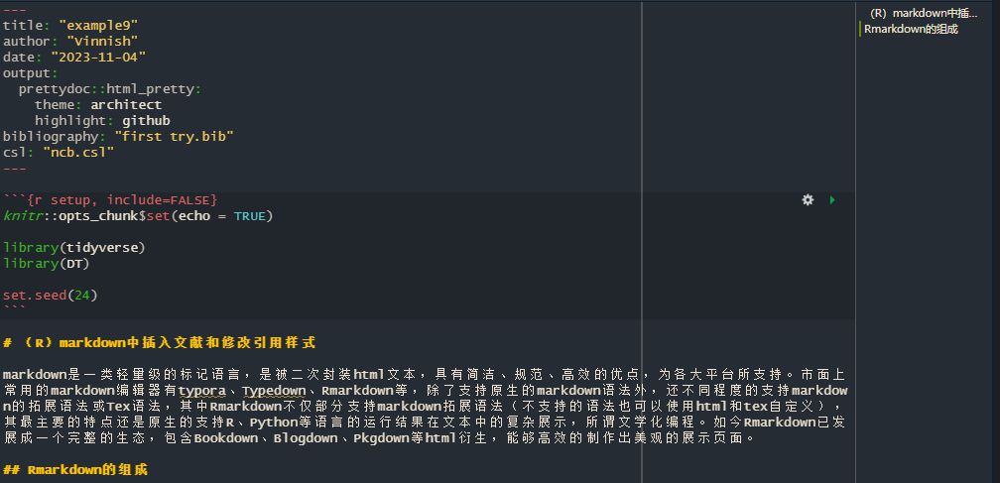
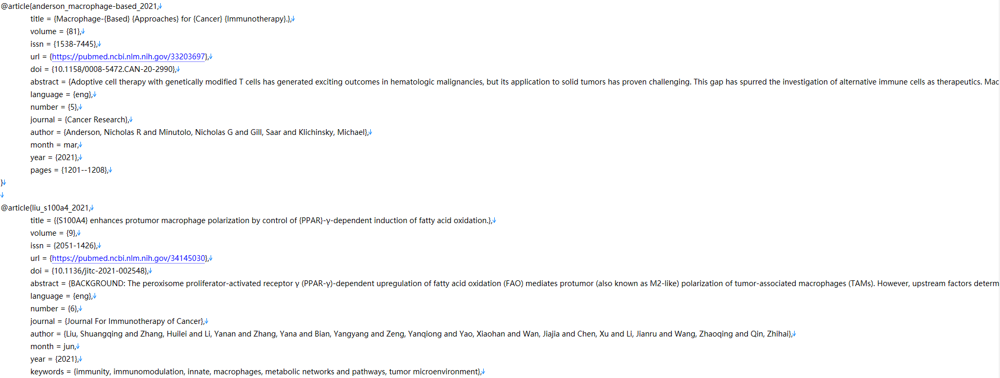
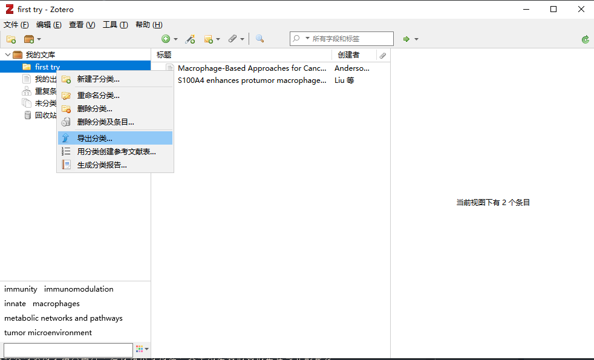
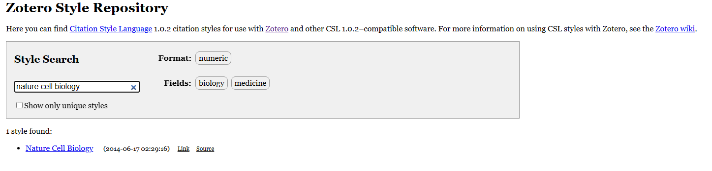
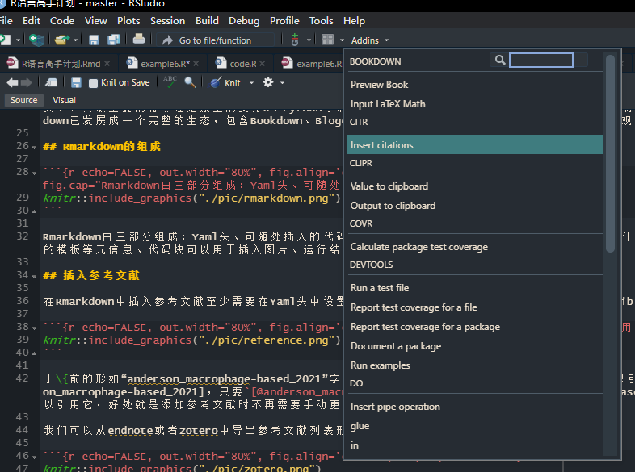

# （R）markdown中插入文献和修改引用样式

markdown是一类轻量级的标记语言，是被二次封装html文本，具有简洁、规范、高效的优点，为各大平台所支持。市面上常用的markdown编辑器有typora、Typedown、Rmarkdown等，除了支持原生的markdown语法外，还不同程度的支持markdown的拓展语法或Tex语法，其中Rmarkdown不仅部分支持markdown拓展语法（不支持的语法也可以使用html和tex自定义），其最主要的特点还是原生的支持R、Python等语言的运行结果在文本中的复杂展示，所谓文学化编程。如今Rmarkdown已发展成一个完整的生态，包含Bookdown、Blogdown、Pkgdown等html衍生，能够高效的制作出美观的展示页面。

## Rmarkdown的组成

(\#fig:unnamed-chunk-1)Rmarkdown由三部分组成：Yaml头、可随处插入的代码块、文本

Rmarkdown由三部分组成：Yaml头、可随处插入的代码块、文本其中Yaml头存储了这篇文档将被导出为什么格式、使用的模板等元信息、代码块可以用于插入图片、运行结果等用途，文本则是我们我们正在写作的部分。

## 插入参考文献

在Rmarkdown中插入参考文献至少需要在Yaml头中设置bibliography，其后为一个bib或bibtex文件。bib文件形如：

(\#fig:unnamed-chunk-2)bib文件就是被整理规范的引用信息

于\{前的形如“anderson_macrophage-based_2021”字样的即为这篇文献的唯一ID。我们可以\@它的ID以引用它[@anderson_macrophage-based_2021]，只要`[@anderson_macrophage-based_2021]`[@anderson_macrophage-based_2021]就可以引用它，好处就是添加参考文献时不再需要手动更改footnote。

我们可以从endnote或者zotero中导出参考文献列表形成bib文件。

(\#fig:unnamed-chunk-3)导出即可

## 修改引用样式

我们可以通过两种方式修改引用样式，一是修改yaml头中的biblio-style，其内包含一系列预设的样式。但是多数情况下我们需要使用期刊推荐的样式，这时候需要在yaml头中添加csl（引用样式列表）文件。

我们可以从[zotero官网](https://www.zotero.org/styles)上查找各期刊的引用格式，如下：

(\#fig:unnamed-chunk-4)点击source字样

光标移至附近点击source字样，然后将其内的代码复制到本地并命名。即可在文本中使用。

## 其它技巧和问题

### 快捷键

我们可以通过`devtools::install_github("crsh/citr")`安装`citr`包，就可以在插件里找到`Insert Citation`功能，点击他会开启一个shiny程序，自动搜索当下的bib文件，提供便捷的引用功能。

(\#fig:unnamed-chunk-5)点击source字样

我们还可以给它设置一个全局快捷键以方便使用，参考[设置Rstudio快捷键](https://blog.csdn.net/qq_42432673/article/details/111088837)，我设置的是`Ctrl Shift V`。

### 引用多篇

用分号隔开即可，如`[@anderson_macrophage-based_2021; @liu_s100a4_2021]`[@anderson_macrophage-based_2021; @liu_s100a4_2021]。

### 导出注意事项

markdown文件导出docx依赖于pandoc，导出html文件依赖于htmlx，导出pdf依赖于Tex。所以除了原生的markdown及其拓展语法外，互不支持。

htmlx支持html、pandoc和tex语法，Tex支持tex语法，pandoc支持pandoc语法。所以如果要导出多种格式，还需要再次修改。

## 参考文献

