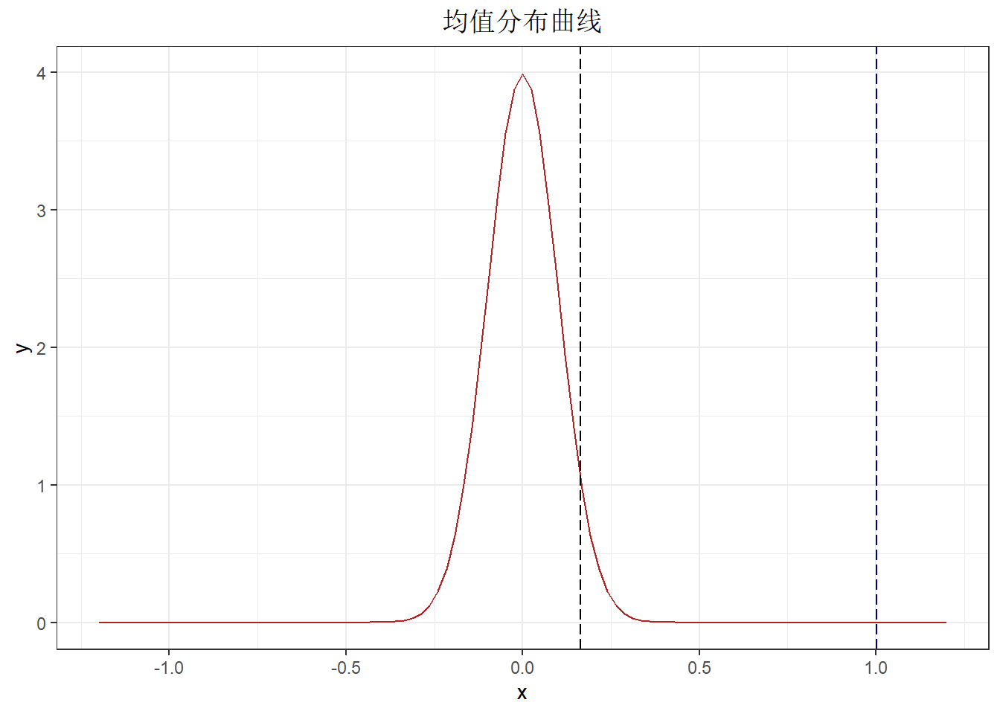
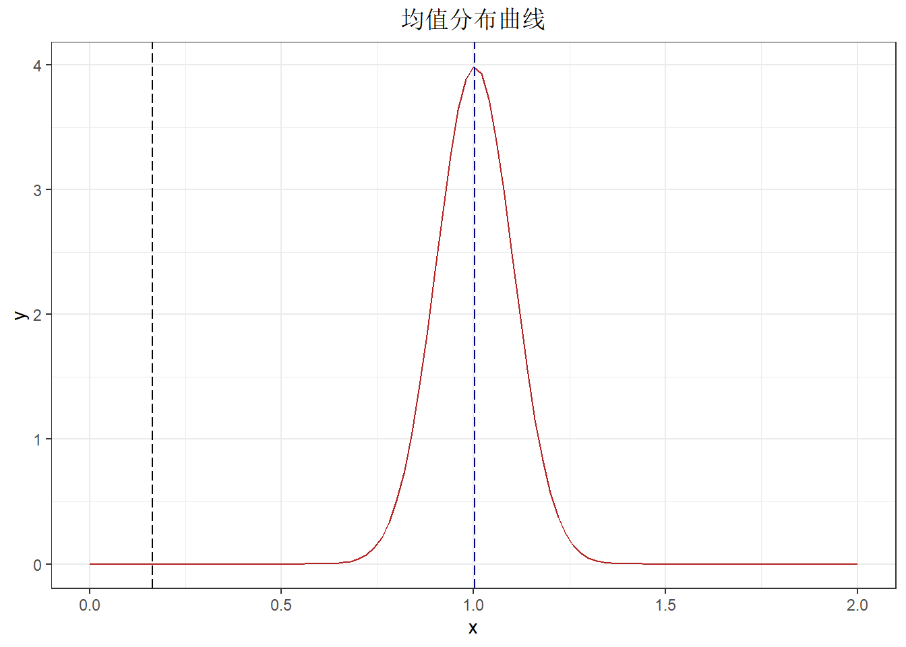

# puzzle2：初试假设检验

## 示例

r中的rnorm函数可以生成若干符合正态分布的数。我们现生成100个总体均值未知（假装未知），总体方差为1的符合正态分布的数。但是先让我假设不知道这列数的总体参数是什么。


```r
x = 1

samples = rnorm(n = 10000, mean = x, sd = 1)
```

假设这些数的总体均数均数不可能小于0，我们要检验这些数的总体均值是等于0还是大于0。

$$
原假设H_0: \mu = 0 \\
备择假设H_1: \mu > 0
$$

在$\alpha = 0.05$的水准上：

1.  能否拒绝$H_0$
2.  有多少的把握(power)能够拒绝$H_0$

### 计算

在原假设H0为真的情况下：

样本服从总体均值$\bar{\mu}$为0，总体方差$\bar{\sigma}^2$为1的正态分布。依据中心极限定理，从总体中抽样的样本均值$\hat{\mu}$服从

$$
\hat{\mu} \sim N(\bar{\mu}, \bar{\sigma}^2/n)
$$


```r
ggplot(tibble(x = c(-1.2, 1.2)), aes(x = x)) +
  stat_function(fun = dnorm, args = list(mean = 0, sd = 1/10), color = "firebrick") +
  labs(title = "均值分布曲线") +
  theme_bw() +
  theme(plot.title = element_text(hjust = 0.5))
```


在$\alpha = 0.05$的水准上，拒绝域为0.95，可以用qnorm计算得给定概率0.95后的下分位点，对于标准正态分布来说是1.6448536，当样本均值$\hat{\mu}$\>$1.644 \times \bar{\sigma}/\sqrt{n}$时，认为可以拒绝$H_0$。

样本均值为1.0029193，大于0.01644，落在拒绝域


```r
ggplot(tibble(x = c(-1.2, 1.2)), aes(x = x)) +
  stat_function(fun = dnorm, args = list(mean = 0, sd = 1/10), color = "firebrick") + 
  geom_vline(xintercept = mean(samples), linetype = 5, color = "navy") +
  geom_vline(xintercept = qnorm(0.95) * 1/10, linetype = 5) +
  labs(title = "均值分布曲线") +
  theme_bw() +
  theme(plot.title = element_text(hjust = 0.5))
```

<div class="figure" style="text-align: center">

<p class="caption">(\#fig:unnamed-chunk-3)α值就是黑色虚线后的曲线下面积</p>
</div>

故在$\alpha = 0.05$的水准上，能够拒绝$H_0$。

接下来我们计算β值。

根据最大似然，样本均数最有可能服从总体均数为样本均数，标准差为1/10（由于总体方差已知）的正态分布。当$\alpha = 0.05$时，拒绝域分位值为0.1644854。β值根据定义为犯二类错误，也就是假阴性的概率，所以可以为黑色虚线前的曲线下面积。


```r
ggplot(tibble(x = c(0, 2)), aes(x = x)) +
  stat_function(fun = dnorm, args = list(mean = mean(samples), sd = 1/10), color = "firebrick") + 
  geom_vline(xintercept = mean(samples), linetype = 5, color = "navy") +
  geom_vline(xintercept = qnorm(0.95) * 1/10, linetype = 5) +
  labs(title = "均值分布曲线") +
  theme_bw() +
  theme(plot.title = element_text(hjust = 0.5))
```

<div class="figure" style="text-align: center">

<p class="caption">(\#fig:unnamed-chunk-4)β值就是黑色虚线前的曲线下面积</p>
</div>

可计算得$\beta = 5.6e-18$，把握值接近于1。

最后我们可以把两组图像画在一起，更直观的观察一下。


```r
ggplot(tibble(x = c(-1.2, 2)), aes(x = x)) +
  stat_function(fun = dnorm, args = list(mean = 0, sd = 1/10), color = "#CD853F") + 
  stat_function(fun = dnorm, args = list(mean = mean(samples), sd = 1/10), color = "firebrick") + 
  geom_vline(xintercept = mean(samples), linetype = 5, color = "navy") +
  geom_vline(xintercept = qnorm(0.95) * 1/10, linetype = 5) +
  labs(title = "均值分布曲线") +
  theme_bw() +
  theme(plot.title = element_text(hjust = 0.5))
```


## 题目

- 让我们去除这些数的总体均数均数不可能小于0的假设，现在的备择假设是双侧的。

$$
原假设H_0: \mu = 0 \\
备择假设H_1: \mu \neq 0
$$

在$\alpha = 0.05$的水准上：

1.  能否拒绝$H_0$
2.  有多少的把握(power)能够拒绝$H_0$

- 一个人声称自己能分辨出星巴克和瑞幸咖啡口味的分别，现有十杯咖啡请他品尝。这个人至少要分辨对多少杯，才在$\alpha = 0.1$的水准上，拒绝这个人在胡说八道（即完全瞎猜，50%的概率预测成功）的假设？


